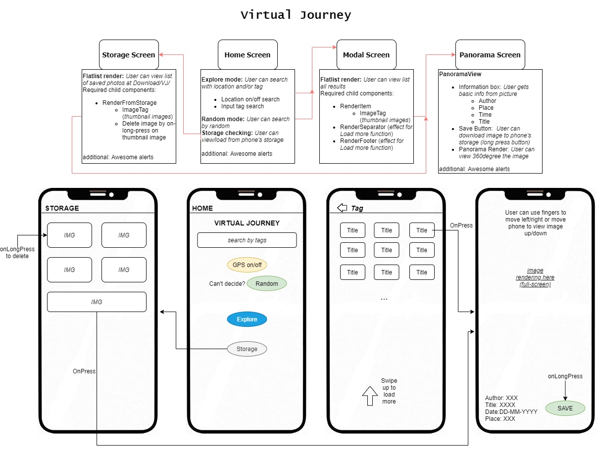

# Final project _Virtual Journey_

# Release 1: 2021-04-19 features

- [x] Users are able to view Home + Modal + Panorama view
- [x] Users are able to call images with tag + location by button
- [x] Users are able to get random list of images by button
- [x] Panorama images are well received and viewed

# Release 2: 2021-04-26 features

- [x] Users are able to load more pictures maximum photos 300
- [x] Users are able to save/load/delete from phone's storage

### Known Bugs

- In panorama screen, when loading image is too fast the first alert box is turned off rapidly by the second alert box
- ~~In panorama screen, before the second alert box ( telling image is loaded succesullly) SAVE button is still clickable before that~~
- ~~There might be alerts about update on unmounted component in Storage screen~~

## Example

Video of [Screencast](https://youtu.be/biuivjoex0g)
<br/>


## Description

|                  |                                                                                                                                                                                            |
| ---------------- | ------------------------------------------------------------------------------------------------------------------------------------------------------------------------------------------ |
| Name             | Yen Tran                                                                                                                                                                                   |
| Topic            | "Mobile application for VR photos". The app allows users to view VR photos called by Flickr API, users can control the photos by touching or phone movement, and save the photos to phone. |
| Target           | Android                                                                                                                                                                                    |
| Language         | React Native                                                                                                                                                                               |
| Google Play link | Will be updated when ready                                                                                                                                                                 |
| App Store        | Will be updated when ready                                                                                                                                                                 |

## Prototype



## Directory Structure

```
app
|-- android
|-- api
|   |-- actions.js
|   |-- types.js
|
|-- component
|   |-- Button.js
|   |-- HomeScreen.js
|   |-- ImageTag.js
|   |-- ModalScreen.js
|   |-- Panorama.js
|   |-- RenderFooter.js
|   |-- RenderFromStorage.js
|   |-- RenderItem.js
|   |-- RenderSeparator.js
|   |-- Storage.js
|-- css
|   |-- styles.css
|-- demo
|   |-- Virtual Journey.jpg
|   |-- demo.mp4
|   |-- demo.gif
|-- ios
|-- App.js
|-- package.json
...
```

## Features

- [x] Find 360 photos with input keyword theme/GPS
- [x] Control photo with touching and phone movement
- [x] Save photos and load photos to/from phone's storage
- [x] Friendly + easy UI

## Modules in use

- [x] Flickr API
- [x] Axios
- [x] [React Awesome Alerts](https://github.com/rishabhbhatia/react-native-awesome-alerts)
- [x] [React Native Panorama View](https://github.com/lightbasenl/react-native-panorama-view)
- [x] [Rn Blob fetch](https://github.com/joltup/rn-fetch-blob/wiki/File-System-Access-API#lspathstringpromisearray)
- [x] [React Native navigation](https://reactnative.dev/docs/navigation)
- [x] [React Native location](https://docs.expo.io/versions/latest/sdk/location/)

## License

MIT
